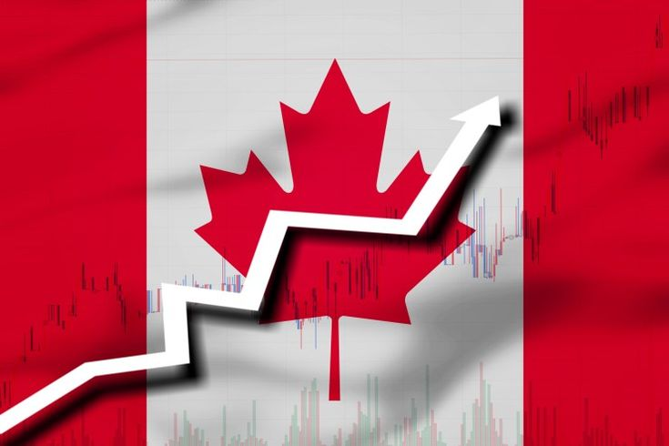
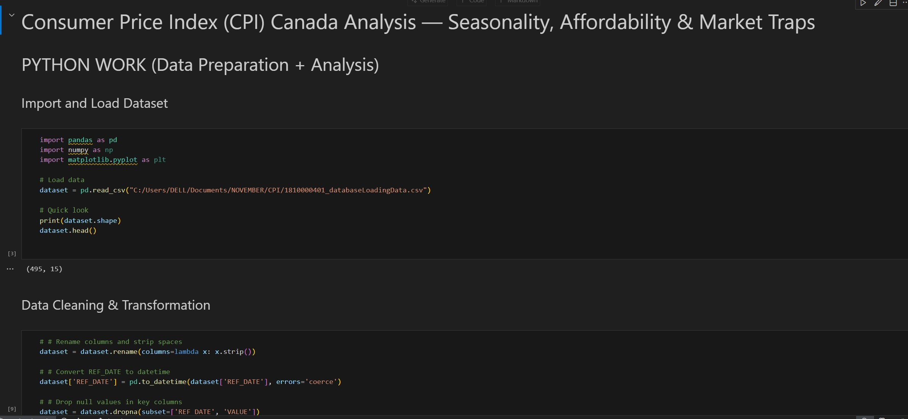
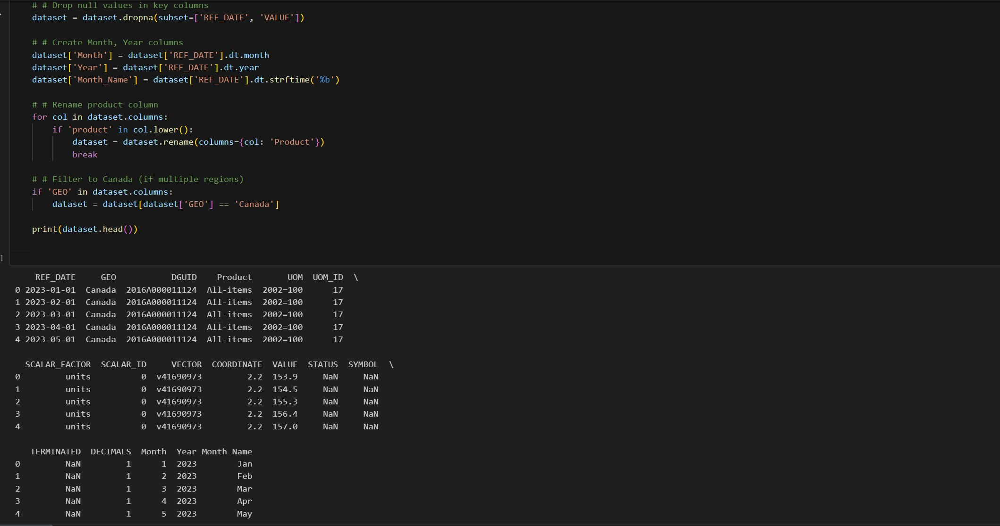
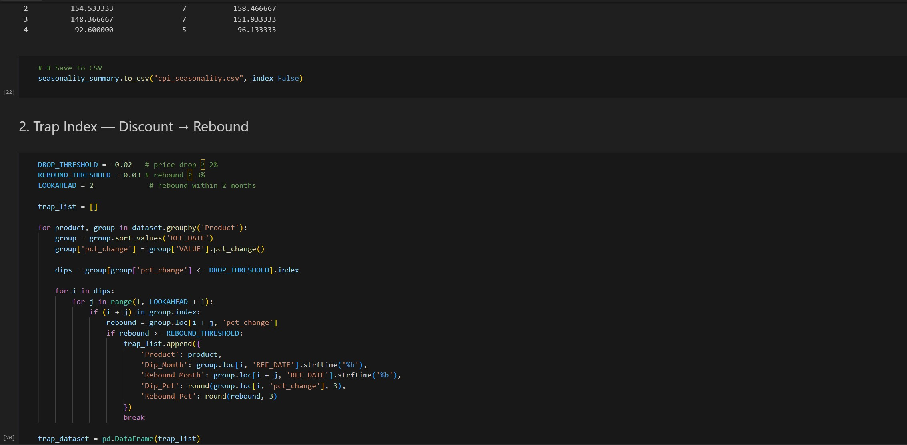
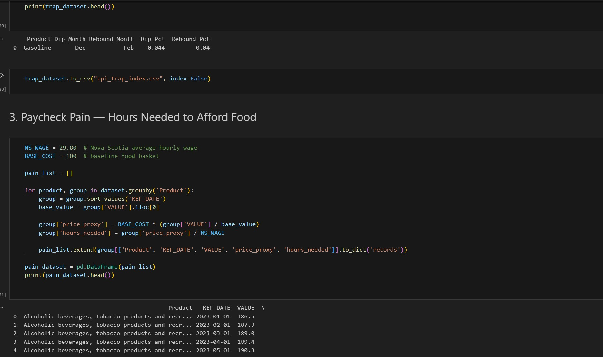
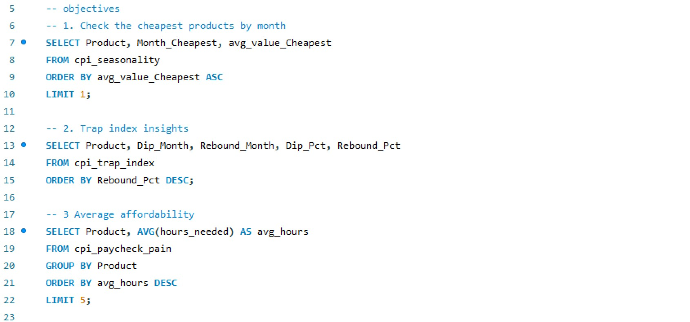

# CPI Canada Price Trends & Affordability Analysis
Seasonality • Price Trap Index • Paycheck Pain • Python • SQL • Power BI

---

# 📖 Project Story — Why This Analysis Matters

 Canadian households feel inflation long before it shows up in formal economic reports.
Grocery bills rise quietly… gas discounts vanish as quickly as they appear… and wages struggle to keep up.
This project was born from one question: 

_“How much does it really cost to live in Canada — and when is the right time to buy?”_

 Using the Consumer Price Index (CPI) from January–November, I explored seasonal price behavior, temporary discount traps, and the true affordability of everyday essentials.
The result is a data-driven guide for shoppers, policymakers, and analysts — backed by Python, SQL, and Power BI. 

# 🎯 Project Objectives
- ✔️ Seasonality — Best Month To Buy
- Find out when products (like gasoline, fruits, meats, etc.) are cheapest or most expensive.
- ✔️ Trap Index — The “Fake Discount” Detector
- Identify price drops that rebound quickly — short-lived promotions designed to trick shoppers.
- ✔️ Paycheck Pain — Real Impact of Inflation
- Translate CPI inflation into hours of work required at the average Nova Scotia wage.
- ✔️ SQL Data Modeling & Power BI Visualization
Organize cleaned CPI results into analytical tables and build a dashboard that generates clear insights.

# 📊 Data Source
Government of Canada Consumer Price Index (CPI) [_Access_Data_source_](https://www150.statcan.gc.ca/t1/tbl1/en/tv.action?pid=1810000403&utm_source=chatgpt.com) 
Monthly price indexes for goods and services (January–November dataset)

**Main Columns Used:**
- _REF_DATE_
- _Products and product groups_
- _VALUE_

# 🧹 1. Data Preparation & Cleaning (Python)
## Raw CPI data was cleaned using Python (pandas):
- Renamed columns for consistency
- Converted REF_DATE into datetime
- Extracted Month, Year, MonthName
- Removed metadata columns (DGUID, UOM_ID, etc.)
- Exported cleaned dataset → cpi_cleaned.csv
 

# 📈 2. Analytical Computations (Python)
## 🟦 A. Seasonality — Best Month to Buy
A new dataset cpi_seasonality.csv identifies:
- Product:	Food/product category
- Month_Cheapest:	Month with lowest CPI
- avg_value_Cheapest:	CPI value at cheapest point
- Month_Expensive:	Month with highest CPI
- avg_value_Expensive:	CPI value at peak

## Interpretation:
- Lower CPI → cheaper than usual
- Higher CPI → inflated or overpriced

# 🟧 B. Trap Index — Detecting Fake Discounts
## Dataset: cpi_trap_index.csv
- Product:	Item with a discount trap
- Dip_Month:	Month when price dropped
- Rebound_Month:	Month it jumped back up
- Dip_Pct:	Discount size
- Rebound_Pct:	Rebound size

**Example Insight:**
- Gasoline dropped –4.4% in December but rebounded +4% by February; This means December’s “discount” was temporary — not a real deal.

# 🟨 C. Paycheck Pain — Hours Needed to Afford Essentials
**Dataset: cpi_paycheck_pain.csv**
- price_proxy	Price level (100 = baseline January)
- hours_needed	Hours of work required

## Interpretation:
- January: 3.35 hours needed
- May: 3.42 hours needed
- A subtle but important increase — inflation is slowly eroding wages.
_You can access the Python File_ [here](https://github.com/0lait0n/CPI-Canada-Price-Trends-Affordability-Analysis/blob/main/PYTHON_CPI_ANALYSIS.ipynb)

# 🗄️ 3. SQL Analysis
After processing with Python, cleaned datasets were stored in SQL and analyzed further.

Three core SQL tables:
- Seasonality Summary
- Trap Index
- Paycheck Pain Affordability
## SQL made it easy to:
- compare cheapest months across multiple categories
- detect month-to-month rebound spikes
- analyze affordability trends across the year
- prepare Power BI sources
_You can access the Queries File_ [here](https://github.com/0lait0n/CPI-Canada-Price-Trends-Affordability-Analysis/blob/main/CPI_Queries.sql)

# 🚦 4. Power BI Dashboard — CPI Canada 2025 Insights

A clean, interactive Power BI report built to explore:
## ⭐ Seasonality
• Identify the months where items are cheapest or most expensive
• Help shoppers plan cost-effective purchases

## ⭐ Trap Index
• Reveal price dips that rebound quickly
• Helps avoid fake discount periods

## ⭐ Paycheck Pain
• Hours of work needed each month
• Shows real affordability beyond CPI numbers

_You can access the Power BI File_ [here](https://github.com/0lait0n/CPI-Canada-Price-Trends-Affordability-Analysis/blob/main/CPI%20Dashboard.pbix)

# 💡 Recommendations
## 👤 For Consumers
- Buy according to seasonal patterns
- Avoid discounts that historically rebound within 1–2 months
## 🏛️ For Policymakers
- Improve transparency around product price cycles
- Prioritize support for items with rising paycheck pain
## 📊 For Analysts & Businesses
- Monitor CPI trends monthly

# 🧰 Tools & Technologies
- Python (Pandas, NumPy):	Data cleaning & analysis
- SQL (MySQL):	Table creation & querying
- Power BI:	Visualization & dashboarding

# ⭐ Final Summary

 It identifies the cheapest and most expensive months to buy products, detects short-term fake discounts, and shows how inflation increases the work hours needed to afford essentials.
 

